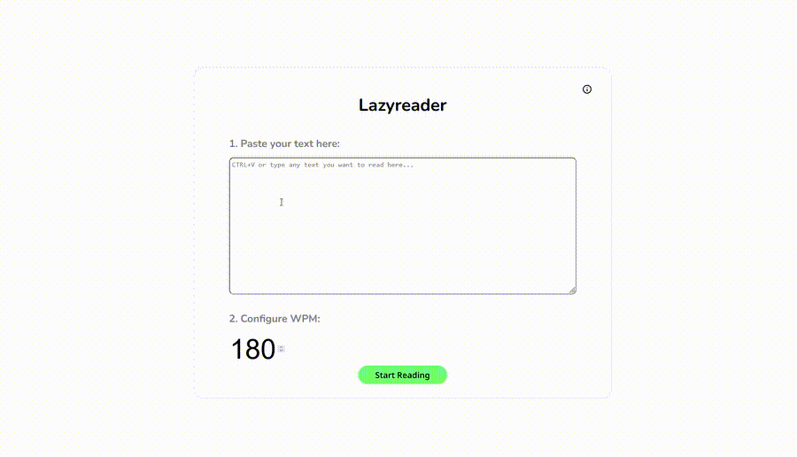

# Lazyreader
Lazyreader is a browser-based reading tool that displays text at a controlled pace while preserving surrounding context to reduce eye strain and improve reading efficiency.

## Why Lazyreader?
Traditional reading speed is often limited by the speed of mechanical eye movement rather than comprehension. Many speed-reading tools address this by displaying one word at a time but at the cost of context and natural peripheral vision. Lazyreader improves on this approach by keeping the reader's focus centered while still presenting surrounding lines of text, allowing for variation in comprehension speed and a more natural reading experience. 

## How to Use
1. Paste raw text into the input field
2. Set a comfortable words-per-minute (WPM) reading rate
3. Click **Start Reading**
4. (Optional) Hold **Spacebar** to temporarily halve the reading speed

## License
MIT License
