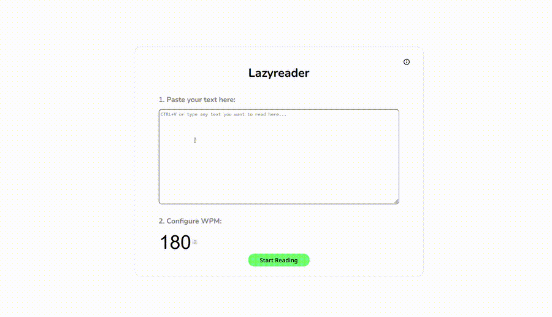

# Lazyreader
Lazyreader is a browser-based reading tool that displays text at a controlled pace while preserving surrounding context to improve reading speed and reduce eye strain without sacrificing comprehension.

## About
During traditional reading, our eyes scan the page at the rate we wish to be reading and this can be exceeded by the rate at which we comprehend the words, thus becoming the limiting factor in how quickly we can read the text. Digital speedreading tools exist that display only one or a few words at once, at a user-specified rate, removing the eye-scanning component from the task of reading. This techinique is referred to as rapid serial visual presentation (RSVP). In my own experience, this sort of tool is effective at facilitating the process of challenging oneself
to read faster, but its ability to do this is held back by a proportionate increase in difficulty of comprehension, thus resulting in a halting form of quick reading interrupted by frequent 
pauses to recall the precise choice of words and intent behind them. Lazyreader attempts to maintain the benefit of regulated scan rate, while reducing the strain on cognition by maintaining the peripheral context present in traditional reading. This is intended to smooth over the per-word comprehension by allowing the reader to be peripherally aware of longer or more difficult words while simpler words are in focus. This should benefit comprehension of meaning as well by extension. Ideally, this tool will allow the reader to externalize pace-regulation, whether intent is to challenge pace or simply offload this aspect from attention for more casual reading, without reducing material comprehension. 

## How to Use
1. Navigate to https://lavieromancinelli.github.io/lazyreader/
2. Paste reading material in raw text form into the input field
3. Set a comfortable words-per-minute (WPM) reading rate
4. Click **Start Reading**
5. (Optional) Hold **Spacebar** to temporarily halve the reading speed. Use this to allow yourself more time to process something complex that you have just read without fully interrupting your reading.
6. Press **Esc** to stop reading. If you wish to resume from the same place later, remove the portion you have read from the input field.